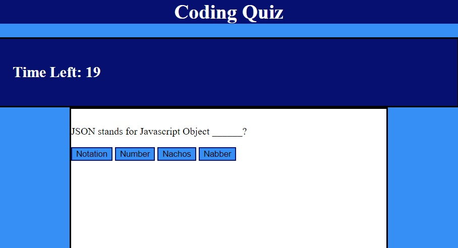
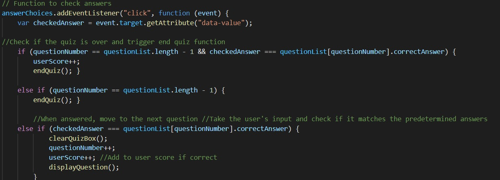

# code-quiz

## Author
Alonzo Roman

## Summary
The goal of this project was to create a multiple choice quiz with a countdown timer and the ability to save user scores and names locally. 

## Screenshot

## Code Snippet

## Steps
- Created repository with Readme

- Created JS, HTML and CSS files

- I began writing the divs and buttons that I would use for the quiz functions

- I styled the page to make it user intuitive

- I began writing the questions that I would use in the quiz

- I created the functions in order to display questions, and take user input as answer values

- I created a timer countdown to begin when the quiz was started

- I created a function to handle the end of the quiz, calculating scores

- I wrote the function to locally store those scores and display them

## Deployed Link
- [https://alonzofroman.github.io/code-quiz/](#)

## Technologies Used
- [HTML] (https://developer.mozilla.org/en-US/docs/Web/HTML)
- [CSS] (https://developer.mozilla.org/en-US/docs/Web/CSS)
- [Javascript] (https://developer.mozilla.org/en-US/docs/Web/JavaScript)

## Contact Links

- Github (https://github.com/alonzofroman)
- LinkedIn (https://www.linkedin.com/in/alonzo-roman/")

## Resources/Acknowledgements 

- W3Schools (https://www.w3schools.com/)
- MDN Web Docs (https://developer.mozilla.org/en-US/)